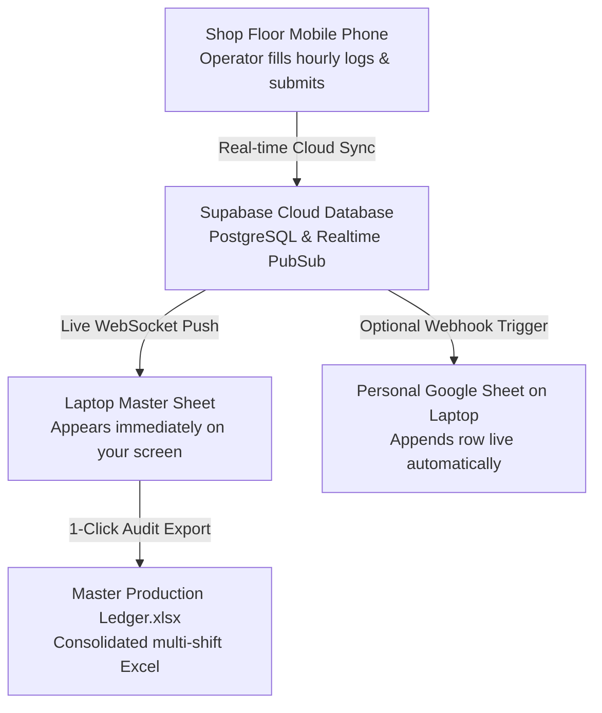

# Radiance Polymers - Online Cloud Deployment & Laptop Master Sheet Live Sync Guide

This comprehensive guide explains how to host your Production Report App online and have shift reports submitted from shop-floor phones immediately reflect in your **Laptop Master Sheet** in real time.

---

## 🏗️ System Architecture



---

## ⚡ Quick 4-Step Setup Checklist

| Step | Action | Time Required |
|---|---|---|
| **1** | Create Free Supabase Database & run Schema | 2 minutes |
| **2** | Deploy App to Vercel or Netlify (Free HTTPS URL) | 2 minutes |
| **3** | Enter Supabase Keys in App Settings | 30 seconds |
| **4** | Open Master Sheet on Laptop & Watch Live Submissions | Instant |

---

## Step 1: Set Up Supabase Cloud Database (Free)

1. Open **[supabase.com](https://supabase.com)** and click **Sign Up / Start your project**.
2. Click **New Project**:
   - **Name**: `radiance-production-db`
   - **Database Password**: Choose a strong password and save it.
   - **Region**: Choose the closest region (e.g., `South Asia (Mumbai)`).
3. Once the project finishes setting up (takes ~60 seconds):
   - In the left sidebar, click **SQL Editor**.
   - Click **Create new query**.
   - Open file [20260922_cloud_sync_master_schema.sql](file:///d:/Sohail%20Pathan/sohail%20pendrive/nexora%20growth/Application%20Data/Production%20Report%20App/supabase/migrations/20260922_cloud_sync_master_schema.sql) in this repository.
   - Copy and paste the entire SQL code into the Supabase SQL editor and click **Run**.
   - You will see: `Success. No rows returned`. The table `shift_reports_sync` and realtime subscription are now active!
4. Get your API credentials:
   - In the left sidebar, click **Project Settings** (gear icon) ➔ **API** (or **Data API**).
   - Copy the following two items:
     - **Project URL** (e.g. `https://xyzabcdef.supabase.co`)
     - **Anon Public API Key** (starts with `eyJ...`)

---

## Step 2: Deploy App Online on Vercel or Netlify (Free)

Your app now includes pre-configured [`vercel.json`](file:///d:/Sohail%20Pathan/sohail%20pendrive/nexora%20growth/Application%20Data/Production%20Report%20App/vercel.json) and [`netlify.toml`](file:///d:/Sohail%20Pathan/sohail%20pendrive/nexora%20growth/Application%20Data/Production%20Report%20App/netlify.toml).

### Option A: Deploy on Vercel (Recommended)
1. Go to **[vercel.com](https://vercel.com)** and sign in with GitHub or email.
2. Click **Add New... ➔ Project**.
3. Import this repository (or run `npx vercel` directly in your terminal).
4. Under **Environment Variables**, add:
   - `VITE_SUPABASE_URL` = Your Supabase Project URL
   - `VITE_SUPABASE_ANON_KEY` = Your Supabase Anon Key
5. Click **Deploy**.
6. Within 60 seconds, Vercel gives you a secure live URL:
   `https://radiance-production.vercel.app`

### Option B: Deploy on Netlify
1. Run `npm run build` in the project folder to generate the `dist` folder.
2. Go to **[netlify.com](https://netlify.com)**, sign in, and go to **Sites**.
3. Drag and drop the `dist` folder onto the Netlify dashboard.
4. Netlify immediately publishes your live site with an HTTPS URL.

---

## Step 3: Enter Supabase Keys in App Settings

Even if you did not add environment variables during deployment, you can configure Supabase directly from inside the app:

1. Open your deployed online app URL or local app on your laptop or mobile phone.
2. Click **Settings** in the navigation bar.
3. Scroll to **System Health & Supabase Cloud**.
4. Enter your **Supabase Project URL** and **Anon Key**.
5. Click **Test Live Connection**.
   - You will see: **"🟢 Supabase Ping Succeeded! Latency: 42 ms"**.
6. Click **Save Configuration**.

---

## Step 4: Using the Laptop Master Sheet

1. Open the app on your laptop and click the **"Master Sheet"** tab in the top navigation bar.
2. You will see:
   - **Live Cloud Status**: `🟢 Supabase Cloud Live` with real-time ping.
   - **KPI Overview**: Total Shifts, Gross Output, Accepted Qty, Rejections %, Downtime Mins, and Average Efficiency %.
   - **Consolidated Production Ledger**: Every shift report logged across all machines (MC03, etc.) is displayed in an executive tabular format with date, shift, machine, operator, tool/part number, target, produced, accepted, rejection %, downtime, and supervisor approval status.
3. **Live Auto-Reflection**:
   - When an operator on the shop floor submits a shift report on their mobile phone, the Supabase Real-time engine immediately pushes the update.
   - Without refreshing your browser, the new report appears live at the top of your Laptop Master Sheet!
4. **Download Master Sheet (.xlsx)**:
   - Click **Download Master Excel (.xlsx)** to download a consolidated multi-shift master workbook styled for management review and auditing.

---

## Step 5 (Optional): Link Directly to Personal Google Sheet on Laptop

If you want every submitted report to also append a new row directly into a Google Sheet on your laptop:

1. In your Google Drive, create a new Google Sheet: `Radiance Polymers - Live Master Production Sheet`.
2. In Google Sheets, click **Extensions ➔ Apps Script**.
3. Replace any code with this exact snippet:

```javascript
function doPost(e) {
  var sheet = SpreadsheetApp.getActiveSpreadsheet().getActiveSheet();
  var data = JSON.parse(e.postData.contents);
  if (sheet.getLastRow() === 0) {
    sheet.appendRow([
      "Date", "Shift", "Machine", "Part Number", "Part Name",
      "Operator", "Supervisor", "Target Qty", "Production Qty",
      "Accepted Qty", "Rejection Qty", "Rejection %", "Downtime (Min)",
      "Efficiency %", "Status", "Submitted At"
    ]);
  }
  sheet.appendRow([
    data.date, data.shift, data.machineNumber, data.partNumber, data.partName,
    data.operatorName, data.supervisorName, data.targetQty, data.productionQty,
    data.acceptedQty, data.rejectionQty, data.rejectionRatePercent + "%",
    data.downtimeMinutes, data.efficiencyPercent + "%", data.status, data.submittedAt
  ]);
  return ContentService.createTextOutput(JSON.stringify({result: "success"})).setMimeType(ContentService.MimeType.JSON);
}
```

4. Click **Deploy ➔ New Deployment**:
   - Click gear icon ➔ select **Web app**
   - **Execute as**: `Me`
   - **Who has access**: `Anyone`
   - Click **Deploy** and copy the **Web app URL** (e.g., `https://script.google.com/macros/s/.../exec`).
5. In your app, go to **Master Sheet ➔ Link Google Sheet**, paste the URL, and click **Test Connection** & **Save Settings**.
6. Every time an operator submits a shift report, a row is automatically appended into your personal Google Sheet on your laptop!

---

## 🛡️ Offline-First Resilience Guarantee

- If internet connectivity drops on the factory floor, operators can still log hours and submit reports without any interruption.
- The app stores everything safely in local storage.
- The moment the device reconnects to Wi-Fi or mobile data, the offline queue automatically flushes and synchronizes all reports to the cloud and your laptop master sheet.
